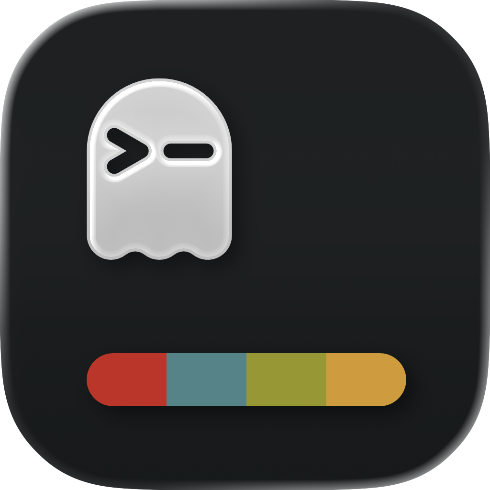

<p align="center">
  
</p>

# Ghostty Setup

A minimal yet highly aesthetic `ghostty` terminal setup focused on **visual candy**, **custom shaders**, and a **clean gruvbox theme**.

## Features

- **Dual Theme Support:** Smooth switching between `Gruvbox Light` and `Gruvbox Dark Hard`.
- **Modern Aesthetics:** Transparent background (`0.85`) with native blur enabled.
- **Custom App Icon:** Uses a beautiful `gruvbox-dark-hard.icns` for macOS.
- **Visual Candy (Shaders):** Pre-loaded with over 40+ custom GLSL shaders (including CRT effects, matrices, fireflies, and custom cursor warps).
- **Fixed Block Cursor:** Clean, non-blinking block cursor.
- **Automation Ready:** Simple `Makefile` setup for managing symlinks easily.

## Key Configurations

| Feature             | Value / Path                                     |
| ------------------- | ------------------------------------------------ |
| Light Theme         | `Gruvbox Light`                                  |
| Dark Theme          | `Gruvbox Dark Hard`                              |
| Opacity / Blur      | `0.85` / `true`                                  |
| Custom Icon (macOS) | `~/.config/ghostty/icons/gruvbox-dark-hard.icns` |
| Active Shader       | `cursor_warp.glsl` (easily swappable)            |
| Cursor Style        | `block` (non-blinking)                           |

## Shaders & Themes Included

This repository comes packed with pre-configured assets:

- **`shaders/`** — 40+ GLSL effects (e.g., `bettercrt.glsl`, `matrix-hallway.glsl`, `cursor_warp.glsl`).
- **`themes/`** — Visual previews for shader combinations (`bettercrt.png`, `bloom.png`, etc.).
- **`images/`** — Custom background wallpapers.

## Requirements

- **Ghostty Terminal** (Latest version recommended)
- **macOS** (For custom `.icns` app icon support)

## Installation

1. Install Ghostty:

```sh
brew install --cask ghostty
```

2. Clone this repository into your dotfiles directory.

```sh
git clone git@github.com:daprabowo/ghostty-setup.git
```

3. Link the configuration files to your Ghostty config directory using GNU Stow:

```sh
make link
```

4. Open or restart Ghostty and enjoy!

## Screenshots


## License

MIT License. Feel free to use, fork, and modify.
